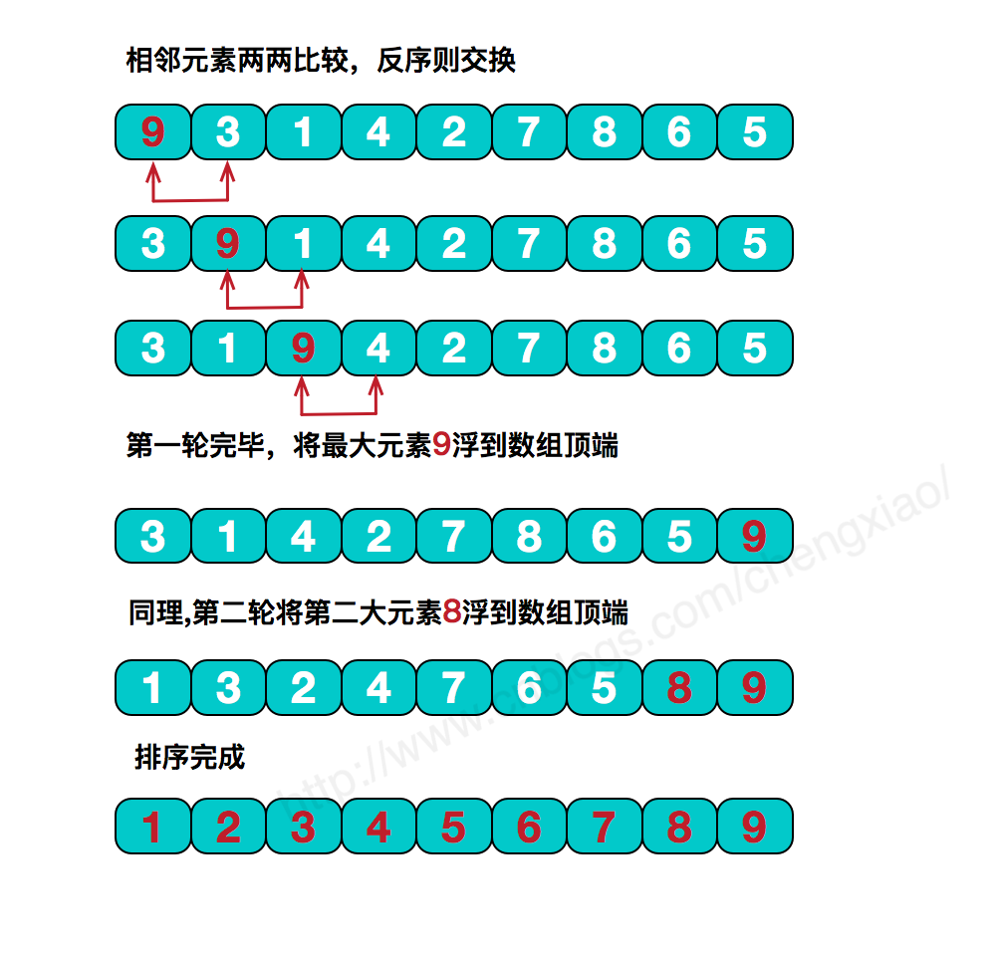
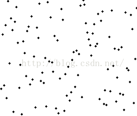

# 基本思想
冒泡排序是排序算法中最简单的一种算法，也是上学时C语言教科书上第一个排序示例使用的算法。

冒泡排序的基本思想是，对相邻的元素进行两两比较，顺序相反则进行交换，这样，每一趟会将最小或最大的元素“浮”到顶端，最终达到完全有序。
过程如下:
1. 比较相邻的元素。如果第一个比第二个大（小），就交换他们两个。
2. 对每一对相邻元素作同样的工作，从开始第一对到结尾的最后一对。这步做完后，最后的元素会是最大（小）的数。
3. 针对所有的元素重复以上的步骤，除了最后已经选出的元素（有序）。
4. 持续每次对越来越少的元素（无序元素）重复上面的步骤，直到没有任何一对数字需要比较，则序列最终有序。

冒泡排序的原理图:



动态图:



# 算法实现
下面是冒泡循环的简单代码实现。
```java
public class BubbleSort implements ISort{
    @Override
    public int[] sort(int[] data) {
        // 外循环从0开始到数组最后一个元素的位置
        for (int i = 0; i < data.length; i++){
            // 内循环从0到data.length - i - 1，也就是说内循环从0到逐步减小的位置下标
            for (int j = 0; j < data.length - i - 1; j++){
                if(data[j] > data[j + 1]){
                    swap(data, j, j + 1);
                }
            }
        }
        return data;
    }
}
```

执行结果:
```java
0, 0, 1, 2, 3, 4, 6, 9, 9, 9, 10, 10, 11, 11, 12, 14, 14, 16, 16, 17, 17, 19, 19, 20, 21, 24, 25, 26, 27, 27, 28, 30, 32, 32, 32, 35, 35, 37, 39, 40, 40, 41, 41, 41, 42, 42, 42, 43, 44, 48,
```

# 算法改进(循环标志)

若在某一趟排序中未发现气泡位置的交换，则说明待排序的无序区中所有气泡均满足轻者在上，重者在下的原则，因此，冒泡排序过程可在此趟排序后终止。为此，在下面给出的算法中，引入一个标签flag，在每趟排序开始前，先将其置为false。若排序过程中发生了交换，则将其置为true。各趟排序结束时检查flag，若未曾发生过交换则终止算法，不再进行下一趟排序。

代码实现:
```java

public class BubbleFlagSort implements ISort{
    @Override
    public int[] sort(int[] data) {
        //设置一个标志
        boolean flag = true;
        for (int i = 1; i < data.length; i++){
            //每次循环都初始化为true
            flag = true;
            for (int j = 0; j < data.length - i - 1; j++){
                if(data[j] > data[j + 1]){
                    swap(data, j, j + 1);
                    //如果有数据交换，flag置为false
                    flag = false;
                }
            }
            //如果没有数据交换，直接退出循环
            if(flag){
                break;
            }
        }
        return data;
    }
}
```

# 算法改进(减小循环次数)

在每趟扫描中，记住最后一次交换发生的位置lastExchange，（该位置之后的相邻记录均已有序）。下一趟排序开始时，R[1..lastExchange-1]是无序区，R[lastExchange..n]是有序区。这样，一趟排序可能使当前无序区扩充多个记录，因此记住最后一次交换发生的位置lastExchange，从而减少排序的次数。


```java
public class BubbleFlagExchangedSort implements ISort{
    @Override
    public int[] sort(int[] data) {
        //设置一个标志
        boolean flag = true;
        int k = data.length - 2;
        int lastExchange = 0;
        for (int i = 1; i < data.length; i++){
            //每次循环都初始化为true
            flag = true;
            //只循环到最后交换的位置
            for (int j = 0; j < k; j++){
                if(data[j] > data[j + 1]){
                    swap(data, j, j + 1);
                    //如果有数据交换，flag置为false
                    flag = false;
                    //记录最后交换的位置
                    lastExchange = j;
                }
            }
            k = lastExchange;
            //如果没有数据交换，直接退出循环
            if(flag){
                break;
            }
        }
        return data;
    }
}
```
# 性能分析

## 时间复杂度

在设置标志变量之后：

当原始序列“正序”排列时，冒泡排序总的比较次数为n-1，移动次数为0，也就是说冒泡排序在最好情况下的时间复杂度为O(n)；

当原始序列“逆序”排序时，冒泡排序总的比较次数为n(n-1)/2，移动次数为3n(n-1)/2次，所以冒泡排序在最坏情况下的时间复杂度为O(n^2)；

当原始序列杂乱无序时，冒泡排序的平均时间复杂度为O(n^2)。

## 空间复杂度

冒泡排序排序过程中需要一个临时变量进行两两交换，所需要的额外空间为1，因此空间复杂度为O(1)。

## 稳定性

冒泡排序在排序过程中，元素两两交换时，相同元素的前后顺序并没有改变，所以冒泡排序是一种稳定排序算法。


