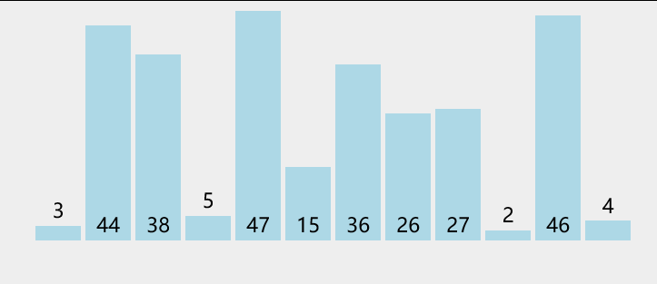
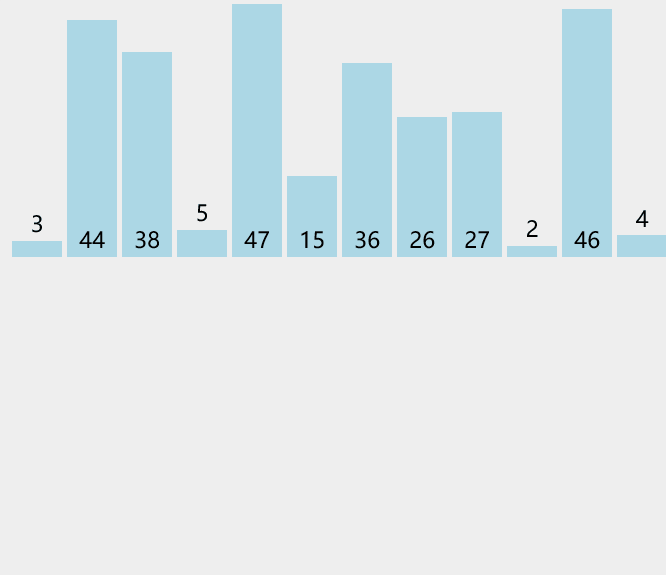

# 插入排序介绍
插入排序也是基于比较的排序。所谓的基于比较，就是通过比较数组中的元素，看谁大谁小，根据结果来调整元素的位置。

因此，对于这类排序，就有两种基本的操作：比较操作和交换操作。

其中，对于交换操作，可以优化成移动操作，即不直接进行两个元素的交换，还是用一个枢轴元素(tmp)将当前元素先保存起来，然后执行移动操作，待确定了最终位置后，再将当前元素放入合适的位置。（下面的插入排序就用到了这个技巧）--因为，交换操作需要三次赋值，而移动操作只需要一次赋值！

有些排序算法，比较次数比较多，而移动次数比较少，而有些则相反。比如，归并排序和快速排序，前者移动次数比较多，而后者比较次数比较多。

插入排序算法有种递归的思想在里面，它由N-1趟排序组成。初始时，只考虑数组下标0处的元素，只有一个元素，显然是有序的。

插入排序的流程如下:

* 然后第一趟 对下标 1 处的元素进行排序，保证数组[0,1]上的元素有序；
* 第二趟 对下标 2 处的元素进行排序，保证数组[0,2]上的元素有序；
.....
.....
* 第N-1趟对下标 N-1 处的元素进行排序，保证数组[0,N-1]上的元素有序，也就是整个数组有序了。
* 它的递归思想就体现在：当对位置 i 处的元素进行排序时，[0,i-1]上的元素一定是已经有序的了。

比如下面的一组数据：


排序过程如下:


# 代码实现

```java
public class InsertionSort implements ISort{
    @Override
    public int[] sort(int[] data) {
        //从第二个元素开始算起
        for (int i = 1; i < data.length; i++){
            //对比的元素
            int tmp = data[i];
            for (int j = i; j > 0; j--){
                //如果前一个值小于对比的元素，进行交换
               if(data[j] < data[j-1]) {
                   data[j] = data[j - 1];
                   data[j - 1] = tmp;
               }
            }
        }
        return data;
    }
}
```

# 算法性能分析
插入排序的时间复杂度 就是判断比较次数有多少，而比较次数与 待排数组的初始顺序有关，当待排数组有序时，没有移动操作（第8行for不成立），此时复杂度为O(N)，当待排数组是逆序时，比较次数达到最大--对于下标 i 处的元素，需要比较 i-1 次。总的比较次数：1+2+...+N-1 ，故时间复杂度为O(N^2)

可以看出，算法中只用到了一个临时变量（第5行），故空间复杂度为O(1)

其实，插入排序的比较次数与数组的逆序数相关，因为插入排序在将某个元素插入到合适位置时（代码第5行），其实就是消除这个元素的逆序数。
