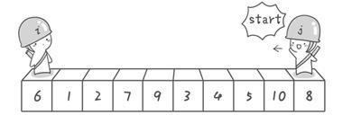
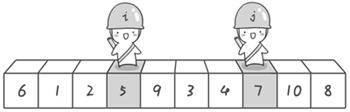
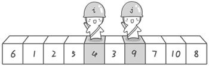

# 快速排序介绍

“快速排序”这个名字听着很高大上，上学的时候也听到这个排序算法，但是时间一久还是会忘，快排虽然很高大上，但是它实际上就是[冒泡排序](../sort/BubbleSort.md)的一种优化排序。

我们回忆一下冒泡排序，发现冒泡排序就是找每个元素在数组中的位置，从第0个元素逐个遍历，每个元素和它后面的所有元素做对比，通过交换位置确定这个元素的最终位置，那么有什么办法减少对比并且在确定位置的时候做一个分区，也就是说这个元素的位置左边元素一定是小于这个元素的值，元素的位置右边的元素一定大于元素的值，有，这个就是快排的思想。

我们借助[【坐在马桶上看算法】算法3：最常用的排序——快速排序](http://www.cnblogs.com/ahalei/p/3568434.html)的例子来介绍快速排序。

# 快速排序实现

假设我们现在对“6 1 2 7 9 3 4 5 10 8”这个10个数进行排序。首先在这个序列中随便找一个数作为基准数（不要被这个名词吓到了，就是一个用来参照的数，待会你就知道它用来做啥的了）。为了方便，就让第一个数6作为基准数吧。接下来，需要将这个序列中所有比基准数大的数放在6的右边，比基准数小的数放在6的左边，类似下面这种排列。

`3 1 2 5 4 6 9 7 10 8`

在初始状态下，数字6在序列的第1位。我们的目标是将6挪到序列中间的某个位置，假设这个位置是k。现在就需要寻找这个k，并且以第k位为分界点，左边的数都小于等于6，右边的数都大于等于6。想一想，你有办法可以做到这点吗？

想想一下我们之前介绍的冒泡排序，是如何通过“交换”，一步步让每个数归位的。此时你也可以通过“交换”的方法来达到目的。具体是如何一步步交换呢？怎样交换才既方便又节省时间呢？先别急着往下看，拿出笔来，在纸上画画看。我高中时第一次学习冒泡排序算法的时候，就觉得冒泡排序很浪费时间，每次都只能对相邻的两个数进行比较，这显然太不合理了。

方法其实很简单：分别从初始序列“6 1 2 7 9 3 4 5 10 8”两端开始“探测”。先从右往左找一个小于6的数，再从左往右找一个大于6的数，然后交换他们。这里可以用两个变量i和j，分别指向序列最左边和最右边。我们为这两个变量起个好听的名字“哨兵i”和“哨兵j”。刚开始的时候让哨兵i指向序列的最左边（即i=1），指向数字6。让哨兵j指向序列的最右边（即j=10），指向数字8。



首先哨兵j开始出动。因为此处设置的基准数是最左边的数，所以需要让哨兵j先出动，这一点非常重要，因为最终态之后，元素的左边的小于等于这个元素的值，元素的右边大于元素的值，而哨兵i的值就是元素本身，所以肯定会小于等于这个元素，所以哨兵j先出动，才能最终把所有的值都遍历完，并且进行交换。

哨兵j一步一步地向左挪动（即j--），直到找到一个小于6的数停下来。接下来哨兵i再一步一步向右挪动（即i++），直到找到一个数大于6的数停下来。最后哨兵j停在了数字5面前，哨兵i停在了数字7面前。




现在交换哨兵i和哨兵j所指向的元素的值。交换之后的序列如下：

6 1 2 5 9 3 4 7 10 8




到此，第一次交换结束。接下来开始哨兵j继续向左挪动（再友情提醒，每次必须是哨兵j先出发）。他发现了4（比基准数6要小，满足要求）之后停了下来。哨兵i也继续向右挪动的，他发现了9（比基准数6要大，满足要求）之后停了下来。此时再次进行交换，交换之后的序列如下：

6 1 2 5 **4** 3 **9** 7 10 8

第二次交换结束，“探测”继续。哨兵j继续向左挪动，他发现了3（比基准数6要小，满足要求）之后又停了下来。哨兵i继续向右移动，糟啦！此时哨兵i和哨兵j相遇了，哨兵i和哨兵j都走到3面前。说明此时“探测”结束。我们将基准数6和3进行交换。交换之后的序列如下：

3 1 2 5 4 6 9 7 10 8


到此第一轮“探测”真正结束。此时以基准数6为分界点，6左边的数都小于等于6，6右边的数都大于等于6。回顾一下刚才的过程，其实哨兵j的使命就是要找小于基准数的数，而哨兵i的使命就是要找大于基准数的数，直到i和j碰头为止。

OK，解释完毕。现在基准数6已经归位，它正好处在序列的第6位。此时我们已经将原来的序列，以6为分界点拆分成了两个序列，左边的序列是“3 1 2 5 4”，右边的序列是“9 7 10 8”。接下来还需要分别处理这两个序列。因为6左边和右边的序列目前都还是很混乱的。不过不要紧，我们已经掌握了方法，接下来只要模拟刚才的方法分别处理6左边和右边的序列即可。现在先来处理6左边的序列现吧。

左边的序列是“3 1 2 5 4”。请将这个序列以3为基准数进行调整，使得3左边的数都小于等于3，3右边的数都大于等于3。好了开始动笔吧

如果你模拟的没有错，调整完毕之后的序列的顺序应该是：

2 1 3 5 4

OK，现在3已经归位。接下来需要处理3左边的序列“2 1”和右边的序列“5 4”。对序列“2 1”以2为基准数进行调整，处理完毕之后的序列为“1 2”，到此2已经归位。序列“1”只有一个数，也不需要进行任何处理。至此我们对序列“2 1”已全部处理完毕，得到序列是“1 2”。序列“5 4”的处理也仿照此方法，最后得到的序列如下：
1 2 3 4 5 6 9 7 10 8

对于序列“9 7 10 8”也模拟刚才的过程，直到不可拆分出新的子序列为止。最终将会得到这样的序列，如下

1 2 3 4 5 6 7 8 9 10

到此，排序完全结束。细心的同学可能已经发现，快速排序的每一轮处理其实就是将这一轮的基准数归位，直到所有的数都归位为止，排序就结束了。下面上个霸气的图来描述下整个算法的处理过程。


快速排序之所比较快，因为相比冒泡排序，每次交换是跳跃式的。每次排序的时候设置一个基准点，将小于等于基准点的数全部放到基准点的左边，将大于等于基准点的数全部放到基准点的右边。这样在每次交换的时候就不会像冒泡排序一样每次只能在相邻的数之间进行交换，交换的距离就大的多了。因此总的比较和交换次数就少了，速度自然就提高了。当然在最坏的情况下，仍可能是相邻的两个数进行了交换。因此快速排序的最差时间复杂度和冒泡排序是一样的都是O(N2)，它的平均时间复杂度为O(NlogN)。其实快速排序是基于一种叫做“二分”的思想。

说道“二分”思想，树型结构也是二分查找的优化版，所以查找很快。


## 递归版本

快速排序最容易实现的就是递归，代码如下:
```java
/**
 * 基础排序算法
 * 复杂度: Q(nlogn)
 * 稳定性: 稳定排序算法
 * 空间复杂度: Q(1)
 */
public class QuickSort implements ISort{
    private int []data;
    @Override
    public int[] sort(int[] data) {
        this.data = data;
        quitSort(0, data.length - 1);
        return this.data;
    }

    private void quitSort(int left, int right){
        int i = left;
        int j = right;
        int tmp = data[i];
        if(left >= right){
            return;
        }

        while(i < j){
            //从右边开始移动的原因是左边第一个是关键值，肯定不会大于关键值
            while (data[j] >= tmp && i<j){
               j--;
            }
            data[i] = data[j];
            while (data[i] <= tmp && i<j){
               i++;
            }
            data[j] = data[i];
        }
        data[i] = tmp;
        quitSort(left, i-1);
        quitSort(i+1, right);
    }
}
```

## 非递归算法

递归算法的根本是使用方法栈来保存之前的调用现场，那么肯定就有非递归算法实现，我们可以用一个栈来保存调用现场。

```java

public class QuickNoRecursiveSort implements ISort{
    private int []data;
    @Override
    public int[] sort(int[] data) {
        this.data = data;
        quitSort(0, data.length - 1);
        return this.data;
    }

    private void quitSort(int left, int right){
        Stack<Integer> stack = new Stack<>();
        stack.push(left);
        stack.push(right);
        while(!stack.empty()) {
            int rightTmp = stack.pop();
            int leftTmp = stack.pop();
            int i = leftTmp;
            int j = rightTmp;
            int tmp = data[i];
            while (i < j) {
                //从右边开始移动的原因是左边第一个是关键值，肯定不会大于关键值
                while (data[j] >= tmp && i < j) {
                    j--;
                }
                data[i] = data[j];
                while (data[i] <= tmp && i < j) {
                    i++;
                }
                data[j] = data[i];
            }
            data[i] = tmp;
            // 交换右边
            if(leftTmp < i - 1){
                stack.push(leftTmp);
                stack.push(i-1);
            }
            if(i + 1 < rightTmp){
                stack.push(i+1);
                stack.push(rightTmp);
            }
        }
    }
}
```


